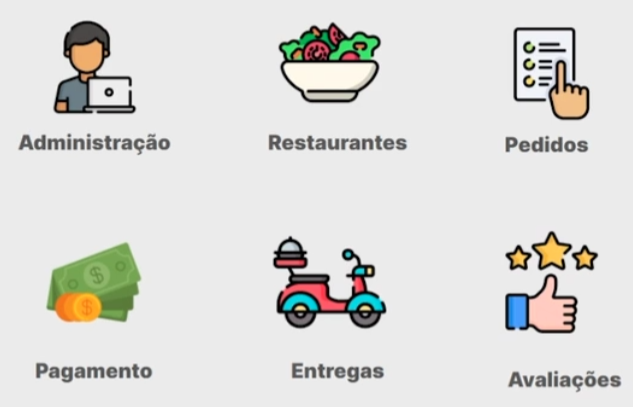
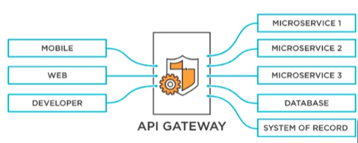
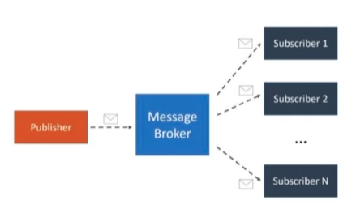
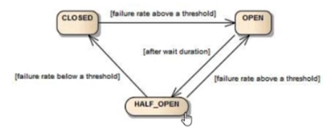
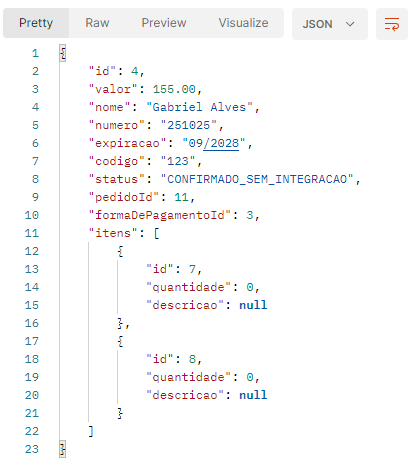
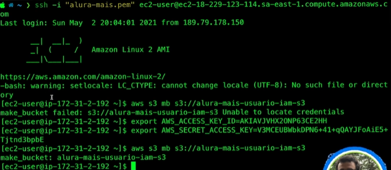
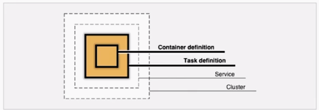

# Formação Aprofunde em Java com arquitetura de Microsserviços, Spring e RabbitMQ:
Curso alura: https://cursos.alura.com.br/formacao-java-microsservicos

Projeto e anotações referentes à formação "Aprofunde em Java com arquitetura de Microsserviços, Spring e RabbitMQ".

---

## Para rodar a aplicação:
* Abrir o Docker Desktop.
* Rodar o comando para subir o container postgres: docker-compose up. 
* Rodar a aplicação através da [MsPagamentosApplication.java](src%2Fmain%2Fjava%2Fbr%2Fcom%2Fgabrieldragone%2Fmspagamentos%2FMsPagamentosApplication.java).
* Acessar o swagger pra fazer as requisições: http://localhost:{{portaDefinidaNoEureka}}/swagger-ui/index.html

---

## Anotações:
### 1. Criando um microsserviço:
#### Podcast: Case Banco PAN: Cloud e Microsserviços Hipster Ponto Tech #306:
* Monolito: 
  * Crises constantes, pouca visibilidade, sem monitoração, dificil "instalar", tempo de desenvolvimento mto grande. Deploy demorado numa estrutura gigante. Dificil escalar. É dificil lançar coisas novas.
* Microsserviços:
  * Mais fácil escalar, fazer manutenção, deploys mais rápidos.
* O que fazer para migrar?
  * Identificar quais módulos existem para separá-los.
  * Verificar onde precisa de mais escalabilidade, estabilidade e performance pra priorizar.
  * Serviços mais críticos.
* Kaizen: Processo de melhoria continua.
#### Curso: Microsserviços na prática: entendendo a tomada de decisões:
#### 01. Boas vindas à realidade:
1. Apresentação:
   * Exemplos reais. Análise de tomadas de decições. Comunicações entre microserviços. Trafeas de plano de fundo. Infra. GitHub Actions.
   * Ms de marketing, ms de pagamento, ms academico.
   * Comunicações assíncronas.
2. Conhecendo o projeto:
   * Tela de preenchimento de dados é um ms.
   * Tela de pagamento é outro ms.
3. Conhecendo cada componente:
   * 
   * Repare que em nenhum momento foi feita comunicação direta, estamos usando comunicação assíncrona.
4. Componentes de linguagens:
   * Todos os componentes de um mesmo serviço precisam usar a mesma linguagem de programação?
     * Não, porém é aconselhável, pois normalmente é apenas uma equipe que será responsável por todo o serviço, dessa forma, utilizando apenas uma linguagem pode facilitar a manutenção da eqioé e contratação de novos colaboradores.
5. Subindo o projeto:
   * Clonar o repositório https://github.com/CViniciusSDias/alura-ms.
   * Rodar comando git clone --recurse-submodules --remote-submodules https://github.com/CViniciusSDias/alura-ms.git
     * Clona repositório central e cada um dos projetos dos submodulos.
   * Rodar docker-compose up --build.
   * Acessar localhost:4200
     * Ao criar o usuario, os ms se comunicam via RabbitMq, envia email.
7. Só um comando:
   * Para termos nosso projeto em pé, bastou utilizartmos o docker-compose.
* OBS: Não continuei pq não gostei a abordagem de um curso de Java e Spring apresentar não ter o foco nessas linguagens.
#### Curso: Microsserviços na prática: implementando com Java e Spring:
* https://cursos.alura.com.br/course/microsservicos-implementando-java-spring
#### 01. Considerações iniciais:
1. Apresentação:
   * Criação de 2 MS.
   * Utilização de Migrations.
   * Service Discovery pros ms se registrarem nele.
   * Balanceamento de carga.
   * API Gateway pra centralizar as requisições.
   * Comunicação síncrona.
   * Cirbuit Breaker.
   * Fallback.
   * 
2. Projeto e conceitos:
   * Objetivos e necessidade:
     * Facilidade de mudança/manutenção.
     * Times menores e autonomos.
     * Reuso.
     * Diversidade tecnológica e experimentação.
     * Maior isolamento de falhas. Caso falhe, não afeta as demais.
     * Escalabilidade independente e flexível.
   * Funcionalidades do monolito migrado:
   * 
   * A ideia é aos poucos remover as partes mais críticas. Aqui isolaremos Pagamento e Pedido.
3. Para saber mais: Arquitetura de Microsserviços:
   * O que são microsserviços?
     * https://cursos.alura.com.br/extra/alura-mais/o-que-sao-microsservicos--c699
     * Monolitos:
       * Mais fáceis de construir, porém conforme o sistema vai crescendo, vão ocorrendo:
         * Demoras no deploy
         * Falhas podem derrubar todo o sistema.
         * Apenas 1 tecnologia para o projeto.
     * Microsserviços:
       * Cada parte do nosso sistema é um serviço independente.
         * Tecnologias independentes.
         * Falha em 1 serviço é isolada.
         * Deploys menores e mais rápidos.
         * Equipes menores e autonomos.
       * Desvantagens:
         * Maior complexidade de desenvolvimento e infra.
         * Debug mais complexo.
         * Comunicação entre os serviços deve ser bem pensada.
         * Diversas tecnologias pode ser um problema.
         * Monitoramento é crucial e mais complexo.
     * Normalmente, quando uma empresa está começando, ela ópta por um sistema monolitico, pq é mais rápido e simples de ser feito.
     * Ai sim, separamos por módulo e vamos dividindo em ms.
   * Tipos de Microservices:
     * https://cursos.alura.com.br/extra/alura-mais/tipos-de-microservices-c698
     * Mais comuns são:
       * Data service: Fornece acesso direto à determinada fonte de dados.
       * Business service: Aglomerado de data service. Não só expôe dados, mas tem regras dentro dele.
       * Translation service: Permite a entrada de dados do nosso sistema e envia pra um sistema externo.
       * Edge service: Permite expor um tipo de serviço pra cada cliente.
5. Preparando o ambiente:
   * https://cursos.alura.com.br/course/microsservicos-implementando-java-spring/task/107427
6. Preparando o ambiente:
   * Seguindo o manual acima e o video, foram configurados o Java 17 e o Maven, o resto eu já tinha.
7. Para saber mais: aprofundando os conhecimentos:
   * Processo de build em projetos java:
     * https://cursos.alura.com.br/extra/alura-mais/processo-de-build-em-projetos-java-c38
     * Ao desenvolver um projeto é muito comum:
       * Estruturar arquivos fonte.
       * Uso de uma nova biblioteca.
       * Realização de testes.
       * Incompatibilidade entre IDEs.
       * Empacotamento e distribuição da aplicação.
     * Pra facilitar todo esse processo, utilizamos de Build Tools.
     * Com ela conseguimos:
       * Automatizar tarefas rotineiras.
       * Manter a compatibilidade entre IDE's.
       * Executar rotinas utilitárias.
     * Apache Ant: Primeira ferramenta, porém existe mta configuração e foi descontinuada.
     * Maven: Configuração através de pom.
     * Gradle.
8. Criando o projeto inicial:
   * Começaremos pelo MS de Pagamento.
   * https://start.spring.io/
   * Configurações que usei:
   * 
     * Obs: Optei pelo Postgres e por não utilizar lombok.
   * Baixado projeto e adicionado aqui.
10. Por que decompor um monolito em um ms?
    *  Pois existe uma facilidade de manutenção e/ou mudanças no projeto, pois teremos um escopo mais enxuto.
    * Escalabilidade independente, pois com a aplicação dividida em partes menores, podemos escalar conforme a necessidade, apenas o que for preciso, economizando recursos e melhorando performance.
    * Experimentação tecnológica, pois podemos usar uma tecnologia, banco, framework diferente. Migrações tbm ficam mais fáceis.
#### 02. Colocando a mão na massa:
2. Model:
   * No código é comum serarmos por 
     * recursos: package by layers, pagamentos, pedidos e dentro termos todas as classes referentes à aquela funcionalidade. 
     * camadas: controller, model, service. Usaremos essa.
   * Criadas Classe Pagamento e Enum Status, com validations e atributos do JPA.
4. Repository e DTO:
   * JpaRepository é uma interface que contém os CRUD's básicos já definidos e encapsulados.
     * Ela tem como papel representar um Bean do Spring, facilita qnd tivermos que injetar esse repositório em outra classe.
   * Jackson é uma biblioteca que faz a serialização dos dados, ou seja, passa de objeto json para objeto java e vice versa.
   * A ideia do DTO é não mostrar ou solicitar dados desnecessários. Inicialmente colocaremos todos os campos da Model, mas iremos alterando ou criando novos DTO's conforme necessário.
6. Service:
   * Classe responsável pela regra negocial.
   * O controller delega para a service as requisições que recebe.
   * Implementado CRUD completo na PagamentoService.
7. Controller:
   * Recebe as requisições, delega para a Service e realiza o retorno de acordo.
   * Realizamos a criação de todos os métodos HTTP respeitando os verbos.
9. Por que usar DTO?
   * Qual alternativa que mais justifica o uso do DTO?
     * Flexibilizar a representação dos recursos recebidos e enviados pela API. Podemos ter várias classes para representar os recursos de forma flexível e variada, expondo somente os atributos desejados.
#### 03. Finalizando a implementação:
1. Migrations:
   * Utilizado pra termos um histórico de como o banco foi evoluindo, de como essas tabelas e campos foram sendo alteradas.
   * Colocamos os arquivos SQL dentro de resources > db.migrations no padrão: V{numero}__{nome_do_comando}.sql. Exemplo:
     * V1__criar_tabela_pagamentos.sql
   * Sempre que tiver uma nova alteração, a gente vai criar um novo arquivo pra podermos ter a evolução em arquivos separados.
2. Configurações:
   * Configurações no application.properties.
   * A professora realizou a configuração através do banco local, porém usei através de docker-compose.yml
   * Ao rodarmos a aplicação, o flyway criará duas tabelas, a do flyway e a do pagamentos.
   * A tabela do flyway contem o histórico das migrations rodadas.
3. Uso de Migrations:
   * Como o Flyway identifica quais migrations já foram executadas no banco de dados?
     * O flyway mantém uma tabela chamada flyway_schema_history, nela são armazenadas as informações a respeito das migrations executadas.
4. Testando a aplicação:
   * Houve um problema na ModelMapper onde foi solicitado uma configuração de bean do tipo ModelMapper.
   * A ideia é que o Spring gerencie essas instâncias, sem que precisemos nos preocupar. Precisamos indicar que ele é um Bean.
   * Realizada configuração dentro de config > Configuracao do Bean que vai retornar o ModelMapper.
   * Não utilizei o Postman confore aulas, configurei o Swagger dentro do pom.xml e acessamos por: http://localhost:8080/swagger-ui/index.html
   * Realização de testes básicos.
5. Para saber mais: injeção de dependência:
   *  https://cursos.alura.com.br/extra/alura-mais/injecao-de-dependencias-o-que-e--c224
   * Quando nossa classe precisa de outra pra realizar uma tarefa, a responsabilidade de criar a dependência não deve ser da própria classe.
   * Sempre que criarmos uma instância de uma classe, a pessoa que instanciar essa classe deverá passar as dependências dessa classe.
   * Como ela vai fazer isso? Dai já é um problema dela.
   * Exemplo em um teste: uma classe service precisa de um repository. Quando formos testar a service, iremos istanciar ela passando um repository mockado.
   * Dessa forma, tiramos a responsabilidade do service de instanciar suas dependências e passamos para a classe que irá utilizar o service.
   * Existem ferramentas (container de injeção de dependência) que já nos ajudam injetando essas dependências. Sempre que alguém pedir uma classe, passe essa instância.
   * Conceito de inversão de dependência está diretamente ligado: devemos depender de interfaces ou abstrações muito mais do que implementações especificas.
     * Se alguém precisar de um PdoStudentRepository, eu não vou passar no construtor que preciso dessa classe e sim da interface StudentRepository que essa implementa. Dessa forma, podemos utilizar qualquer classe que implemente o StudentRepository, sendo ela uma API, uma PDO, ORM, ou de qualquer outra forma.
     * Dessa forma, fazemos nosso código depender mais de abstrações, do que de implementações que podem mudar a todo momento.
8. Uso de anotações:
   * Pra que usamos o @RequestBody na declaração do método POST?
     * Para o Spring conseguir recuperar as informações no corpo da requisição.
#### 04. Serviço de descoberta:
1. Service discovery e registry:
   * Vamos supor que temos diversas aplicações rodando na nossa rede, cada um operando em um IP.
   * Como sabemos onde estão todos esses serviços? Nossa aplicação frontend ou até o proprio back pode não saber quais são todos esses serviços, em qual porta ou ip esses demais estão operando.
   * Service Discovery: É como se fosse um catálogo que vai conhecer, ter o endereço, de todas as instâncias dos ms que estiverem registrados nele para assim redistribuir para o ms certo.
   * Usaremos o Eureka Service da Spring Cloud Netflix.
   * Criaremos um novo projeto, pegando essa dependência:
   * 
   * Abrir na IDE.
   * Configurar o application.properties desse novo projeto informando a porta fixa pra subir na 8761 padrão, mas foi colocado 8081.
   * Eureka pode atuar tanto como servidor, qnt como dependência em algum projeto pra atuar como cliente. 
   * Nosso caso é um projeto dedicado para o servidor, precisamos indicar mais duas propriedades para não fazer o registro dessa própria aplicação no serviço de descoberta.
   * Anotamos a classe main com @EnableEurekaServer pra indicar que trabalharemos com servidor Eureka.
   * Rodar aplicação e acessar: http://localhost:8081/
2. Para saber mais: client-side e server-side discovery:
   *  https://cursos.alura.com.br/course/microsservicos-implementando-java-spring/task/107472
   * Trabalhar com arquitetura de ms tem seus desafios, um exemplo, instâncias dos serviços mtas vezes tem URL's geradas dinamicamente, devido à atualizações ou autoscaling.
   * Dessa forma, fica dificil saber exatamente qual a URL exata daquele ms, então precisamos que o código do cliente "descubra" de forma dinâmica quais os endereços disponiveis das instâncias atualizadas ou escaladas.
   * O serviço de descoberta funciona de duas formas:
     * É necessário ter um serviço onde as instâncias se registrem, service registry.
     * E é necessário que exista uma forma para que esse serviço seja localizado por outro serviço (esses que podemos chamar de "cliente" ou "consumidor").
   * Para que um serviço conheça nossas instâncias, utiliza-se o padrão self registration, onde cada instância deve se auto-registrar no servidor.
   * Existem dois padrões principais de service discovery:
     * client-side discovery: o cliente (ms ou API gateway) consulta o service registry, pega a lista de instância do serviço que ele quer consumir e ele mesmo é responsável pelo balanceamento de carga.
     * server-side discovery: Já nesse caso, ao invés de consultar o service registry, o cliente envia uma solicitação para uma camada intermediária como um DNS ou roteador, que faz a consulta ao service registry e o balanceamento de carga, retornando a requisição a uma dessas instÇancias, garantindo que nenhum servidor seja sobrecarregado e desacoplando essa lógica do cliente.
3. Configurando o MS de Pagamento:
   *  Na classe principal desse projeto, iremos ativar o @EurekaEurekaClient pra que a aplicação saiba que é um Cliente Eureka e que vai precisar se registrar em um Servidor Eureka.
   * Foi necessário baixar a dependencia spring-cloud-netflix-eureka-client.
   * Realizaremos a configuração do nome da aplicação no .properties, pois será a partir dela que o Eureka vai conhecer os serviços.
   * Definimos tbm a URL pro eureka server e a porta 0 para que o eureka controle em qual porta a aplicação vai subir.
   * Tive um erro "Unable to instantiate factory class [org.springframework.cloud.netflix.eureka.config.EurekaConfigServerBootstrapper] for factory type" que foi resolvido atualizando o spring-cloud-netflix-eureka-client pra uma versão mais recente. Tbm foi necessário retirar a EnableEurekaClient e inserir a @EnableDiscoveryClient. 
   * No .properties, foi necessário adicionar as configurações pra aplicação se registrar no Eureka Server.
   * Resolvi vendo esse video: https://www.youtube.com/watch?v=5ZRmVOEaU64
   * Rodar a aplicação e acessar: http://localhost:8081/
   * Verificar se a aplicação apareceu no Eureka Server:
   * 
   * Pra sabermos a porta aleatória, basta clicar no link acima e alterar o link pra local host com essa porta.
4. Incluindo outro Microsserviço:
   * Incluiremos o ms de pedidos.
   * Para não apenas baixar o projeto da instrutura, eu criei um novo projeto usando Kotlin e Gradle, e fiz toda a configuração para utilizar o mesmo: https://github.com/GabrielDragone/formacao-java-microsservicos-ms-pedidos
   * Ajustes no projeto, inserindo o Eureka Client.
5. Vantagens do service discovery:
   * Sobre discovery e registry?
     * É necessário ter um service registry para que as instÇancias consigam se registrar.
     * É necessário incluir uma anotação na aplicação para habilitar o service registry na aplicação. @EnableEurekaClient/@EnableDiscoveryClient.
     * Service discovery é o processo onde um serviço consegue descobrir dinamicamente o endereço das instâncias do serviço que deseja consumir. Um MS precisa saber a localização (endereço de IP e porta) de cada outro serviço com qual ele precisa se comunicar. Para reduzir essa complexidade, utiliza-se o serviço de descoberta, onde os ms se registrar por nome.
#### 05. Gateway e Load balancer:
1. Incluindo o Gateway:
   *  Quando estamos trabalhando com ms, um ponto chave é termos um único ponto de entrada para a aplicação. Centralizar acessos aos serviços, sem necessidade de ficarmos controlando endpoint, porta, etc.
   * Iremos criar um novo projeto só que dessa vez utilizando o Spring Cloud Gateway:
   * 
   * Link repositório: https://github.com/GabrielDragone/formacao-java-microsservicos-ms-gateway
   * Realizamos as configurações no .properties e na main pra se registrar ao Eureka Server.
   * Rodamos a aplicação Eureka, as demais e o gateway pra verificarmos se as mesmas registraram no Eureka: http://localhost:8081/
   * Como o gateway é um ponto central pra fazermos as chamadas aos microsserviços, não precisaremos mais chamar os ms por {{url-ms}}:{{porta}} de cada ms, podendo assim chamar por localhost:{{porta-gateway}}/{{servico}}/uri. Exemplos:
     * http://localhost:8082/ms-pagamentos/api/v1/pagamentos
     * http://localhost:8082/ms-pedidos/api/v1/pedidos
   * Resolvido problema relacionado ao Docker Desktop criando alias para o localhost, impedindo assim a aplicação de rodar corretamente: https://stackoverflow.com/questions/57319678/spring-boot-cloud-eurka-windows-10-eurkea-returns-host-docker-internal-for-clien
2. Para saber mais: o que é API Gateway?
   * É um padrão de microsserviço que permite centralizar todos os acessos dos serviços em um unico ponto, tendo assim um unico ponto de entrada:
   * 
   * Ele trabalha junto com o serviço de descoberta (no nosso caso o Eureka Server).
   * Se houvesse alguma mudança na URL de algum microsserviço, se não tivessemos o API Gateway, teriamos que alterar em todos os serviços que utilizam o mesmo.
   * API Gateway tbm fornece um proxy, fornecendo a exposição de apenas alguns endpoints que necessitam ser expostos e outros não.
   * Desvantagens:
     * Por ser um ponto central, podemos ter um ponto central de falha. Se ele cair, todas as aplicações caem.
     * Vai receber muitas requisições.
   * O API Gateway tbm pode fazer:
     * Roteamento.
     * Balanceamento de carga.
     * Logging: Realizar log de tudo o que entra na aplicação.
     * Informa ao cliente como cada URL deve ser armazenada em cache.
     * Realizar autenticação utilizando algum serviço externo.
     * Cuidar dos certificados.
   * Comportamentos:
     * Autorizar e redirecionar requests.
     * Usar Decorator para adicionar informações necessárias ao Request.
     * Limitar o acesso ou conteúdo trafegado.
   * Outro padrão semelhante ao API Gateway seria o BFF (Backend For Frontend):
     * Ter um serviço que centraliza as requisições do front e redireciona para os serviços solicitados.
3. Balanceamento de carga:
   * Escalabilidade horizontal (adicionar mais nós) de apenas uma determinada parte da aplicação. Exemplo: Escalar apenas serviço de pedidos.
   * O API Gateway tbm faz esse papel. Podemos subir várias instâncias de um serviço e a cada requisição ele direciona fazendo o balanceamento da carga.
   * Realizamos a configuração dentro do properties do pagamentos e de pedidos, inserindo uma identificação única através da config eureka.instance.instance-id.
   * Criamos um endpoint em cada ms pra pegar a porta da aplicação.
   * Rodamos a aplicação e verificamos o id gerado no Eureka Server.
   * Iremos rodar mais de uma instância de cada aplicação, usando o comando:
     * Para maven usar: & "D:\Projects\formacao-java-microsservicos-ms-pagamentos\mvnw.cmd" spring-boot:run -f "D:\Projects\formacao-java-microsservicos-ms-pagamentos\pom.xml"
     * Para gradle usar: ./gradlew bootRun
   * Exemplo:
   * 
   * Ao realizarmos requisições para a porta, o gateway ficará intercalando para fazer o Balanceamento de Carga:
     * Aplicação rodando na porta 49167
     * Aplicação rodando na porta 49220
     * Aplicação rodando na porta 49251
4. Load balancing:
   * Na arquitetura que estamos usando, qual dos projetos está fazendo o papel de balancear carga?
     * O Gateway.
     * O Spring Cloud Gateway obtém a lista de endereços de todos os serviços registrados no Eureka Server, configura uma rota dinâmica para esses serviços e já faz o balanceamento de carga nas requisições.
#### 06. Integração entre Microsserviços:
1. Usando o Spring Feign:
   * Comunicação síncrona x Comunicação assíncrona.
   * Spring Cloud OpenFeign é uma solução Client HTPP pra fazer requisições entre microsserviços.
3. Comunicação síncrona:
   * Adicionamos o sprinc-cloud-starter-openfeign no projeto.
   * Anotamos a main com @EnableFeignClients.
   * Criada a client/PedidoClient que é a interface para realizar a comunicação. Nela precisamos informar o nome do ms e criar um método de comunicação para realizar a comunicação.
   * Na service criamos o novo método pra atualizar pagamento do pedido e na controller o método pra chamar o mesmo.
   * Ao chamarmos o endpoint de aprovar pagamento, o processo se inicia no ms de pagamentos e chama o de pedidos e atualiza corretamente os registros.
   * Essa seria a comunicação sícrona, ou seja, enviamos e na hora temos o retorno.
4. Para saber mais: comunicação assícrona:
   * Já a comunicação assícrona, é aquela que não precisamos aguardar um retorno da resposta do outro serviço pra continuar o fluxo.
   * O que é Mensageria?
     * https://cursos.alura.com.br/extra/alura-mais/o-que-e-mensageria--c1136
     * Mensageria é um conceito que define que sistemas distribuídos possam se comunicar por meio de troca de mensagens (evento), sendo estas mensagens 'gerenciadas' por um Message Broker (servidor/módulo de mensagens).
     * Dois sistemas se comunicam de forma assícrona. Sistema A não precisa esperar o sistema B responder, sendo assim, avisa depois.
     * A mensagem é adicionada à um Message Broker. Algum outro software vai ler essa mensagem e processar.
     * Pub / Sub: Publisher Subscriber:
     * 
     * Analogia de envio de encomendas: Eu sou o Publisher pois envio a encomenda, o Correios é Message Broker, pois ele será responsável por entregar a encomenda ou gerenciar se a mesma não foi entregue pra entregar outro dia e você será o Subscriber, a pessoa interessada em receber a mensagem.
5. Circuit breaker e fallback:
   * Nossos serviços se comunicam entre si. Uma falha em algum serviço, pode ocasionar numa falha em cascata.
   * O Circuit Breaker é como se fosse um disjuntor, que fica com status aberto ou fechado. Mas ele pode ter três estados:
   * 
     * CLOSED: O melhor estado. Todos os serviços estão operando perfeitamente e todas as comunicações operando com sucesso.
     * OPEN: Se tivermos uma faixa de falhas acima do que configurarmos por padrão, entra nesse estado. Nesse estado a gente para de tentar fazer a comunicação e ai precisamos configurar o fallback. Existe uma configuração de tempo de que ele esteja aberto para passarmos para o próximo status.
     * HALF_OPEN: Aqui, se as requisições passarem com sucesso, é passado novamente pro estado CLOSED. Se continuar falhando, volta pra OPEN.
   * Utilizaremos o Resilience 4j. https://resilience4j.readme.io/docs
   * O conceito de circuit breaker, que interrompe um chamado a um serviço quando as requisições com falha de comunicação atingirem um número específico.
   * A implementar o fallback, que é a forma com que um microsserviço vai tratar a falha de comunicação, ou seja, uma estratégia para que a inoperabilidade de um serviço não afete o outro.
   * Incluiremos a dependência no pom e existe uma configuração yaml que fazemos o controle por instancia.
   * Anotamos qual o endpoint que faz precisa dessa tratativa do Circuit Breaker.
   * Realizada configuração no .properties.
   * Rodaremos as aplicações, mas não rodaremos a pedidos pra simularmos ela off.
   * Ao chamarmos a aplicação, as duas primeiras vezes (conforme configuramos no properties) vão ocorrer o seguinte erro:
   * 
   * Na terceira vez ocorrerá o CallNotPermittedException:
   * 
   * Esse é o conceito de fail fast, entrando na tratativa e impedindo de realizar mais chamadas.
   * Ai entramos no plano B, que seria o FALLBACK. O que faremos se ocorrer essa situação de falha acima?
   * Uma ideia para esse projeto, seria termos um novo status CONFIRMADO_SEM_INTEGRACAO informando que nao foi possivel fazer a sincronização.
   * Criamos o novo método no controller para realizar o FALLBACK. Ao tentarmos confirmar o pagamento, na terceira vez vai entrar no fallback e vai atualizar o status pra CONFIRMAR_SEM_INTEGRACAO.
6. Comunicação síncrona:
   * João precisa de um método específico que necessita de uma resposta imediata de outro ms e optou por fazer a chamada sícrona com Open Feign. A alteranativa que melhor representa a configuração que ele precisa fazer é:
   * 
7. Faça como eu fiz:
   * Desafio de implementar uma busca pra pegar os itens do pedido no ms de pedidos, consultando através do ms de pagamentos.
   * Criadas classes Pedido e ItemDoPedido.
   * Criado novo método em PedidoClient.
   * Incluir o atributo itens dentro do PagamentoDto.
   * Dentro da service no método obterPorId, realizar a busca pelo client e setar o retorno no dto.
   * Teste:
   * 
* THE END!
---
### 2. Deploy do microsservico na nuvem:
#### Curso: Microsserviços na prática: IaC com CDK e deploy na AWS:
* https://cursos.alura.com.br/course/microsservicos-pratica-iac-cdk-deploy-aws
#### 01. Projeto inicial e containers:
1. Apresentação:
   * Vamos utilizar Docker, AWS, AWS Fargate (configuração da infra).
3. Ponto de partida:
   * Migração do código no monolito para dois ms.
   * O foco desse curso é pensarmos na parte da infra.
   * Temos dois ms, com dois bancos.
   * Utilizamos o Eureka Server, Load Balancer, Api Gateway, tudo para que esses MS pudessem se comunicar.
5. Utilizando docker:
   * O docker é uma ferramenta de conteinerização, que vai facilitar nosso processo de entrega e deploy pq isolaremos nossas aplicações em containers.
   * Começaremos isolando a aplicação de pedidos.
   * Nela, retiraremos a dependência do eureka client, comentaremos as configurações dentro do properties e na main class.
   * Rodaremos a aplicação normalmente, só que agora a mesma não passará pelo gateway.
   * Através do Docker Desktop, a instrutura baixou uma imagem do MySql e rodou um container utilizando a mesma.
   * Alterou a configuração no properties e testou.
   * No meu caso, já estou utilizando docker pra rodar o banco desde o início.
6. Para saber mais: utilizando o MySQL com Docker:
   * https://cursos.alura.com.br/extra/alura-mais/como-rodar-mysql-com-docker--c132
   * Docker é a container engine mais popular e é utilizado para executar processos isoladamente. Com ele podemos instalar e executar software sem "sujar" o sistema por baixo, criar redes, mapear volumes e muito mais. É muito utilizado para rodar uma parte da infra que a aplicação precisa para funcionar, como por exemplo servidores web, filas, caches ou banco de dados.
   * Terminal: docker image pull mysql:5.7
   * Compartilhamento de determinado driver pra ser o Volume.
   * Escolhido o C.
   * docker container run mysql:5.7 só que esse comando vai dar erro devifo à variáveis de ambiente que precisam ser passadas.
   * Pra passar as variaveis de ambiente utilizamos o -e: docker run -e MYSQL_ALLOW_EMPTY_PASSWORD=yes mysql:5.7
   * E pra indicar o volume utilizamos o -v caminhoLocal:caminhoDentroDoContainer (indicado na documentação): docker run -e MYSQL_ALLOW_EMPTY_PASSWORD=yes -v D:\Projects\Docker\mysql:/var/lib/mysql mysql:5.7
   * O container vai rodar na porta 3306.
   * Pra vermos os containers rodando: docker container ls.
   * Pra inspecionarmos um container: docker inspect idContainer.
   * Pra conseguirmos rodar comandos dentro do container no modo interativo, rodamos: docker exec -it idContainer bash.
   * Mexendo com o banco mysql:
     * mysql -u root.
     * show databases;
     * create database aluramais;
     * use aluramais;
     * CREATE TABLE IF NOT EXISTS `fruit` (`fruit_id` int(10) unsigned NOT NULL auto_increment, `name` varchar(50) NOT NULL, `variety` varchar(50) NOT NULL, PRIMARY KEY (`fruit_id`));
     * INSERT INTO `fruit` (`fruit_id`, `name`, `variety`) VALUES (1, 'Apple', 'Red Blabla');
     * select * from fruit;
   * Pra parar o container forçando: docker rm idContainer --force.
   * Se verificarmos na pasta do volume, os dados do banco ainda estão lá:
   * 
   * Se subirmos novamente outro container, passando a mesma config de volume, ele já vai pegar esses dados:
     * docker run -e MYSQL_ALLOW_EMPTY_PASSWORD=yes -v D:\Projects\Docker\mysql:/var/lib/mysql mysql:5.7
     * docker container ls
     * docker exec -it a3d514efe360 bash
     * mysql -u root
     * show databases;
     * use aluramais;
     * select * from fruit;
   * Podemos utilizar o mariadb tbm.
7. Gerando a imagem da aplicação:
   * Com a nossa aplicação em um container, fica mais fácil disponibilizarmos ela para outras pessoas.
   * Para criarmos uma imagem da nossa aplicação, precisaremos criar um arquivo chamado Dockerfile (sem extensão), esse que é um arquivo texto com alguns comandos para conseguirmos montar a imagem.
   * Criamos o arquivo no ms-pedidos seguindo a documentação: https://spring.io/guides/topicals/spring-boot-docker/
   * Exemplo:
   * 
   * Pelo proprio botão verdinho, iremos clicar na opção Build Image on Docker. Porém por aqui, gera um nome genérico, onde temos que editar através da aba Service (Docker integrado na IDE). Ficará assim:
   * 
   * Para disponibilizarmos essa imagem para outras pessoas, precisamos inseri-la num repositório público. Precisamos ter uma conta no dockerhub: https://hub.docker.com/repository/docker/gabrieldragone/ms-pedidos/general
8. Para saber mais: desvendando o Dockerfile:
   * https://www.alura.com.br/artigos/desvendando-o-dockerfile
   * Dificilmente algo que rodou no container em sua máquina, não vai rodar em produção.
   * Dockerfile é um meio que utilizamos para criar nossas próprias imagens.
   * Construimos a imagem através do docker build.
   * Rodamos o container atraves do docker run.
   * 
   * Quando rodamos o docker build, além de baixar a imagem do ubuntu, também é rodado os comandos apt-get update e apt-get install openjdk-8-jdk-y.
   * Quando separamos os comandos em RUN, cada etapa pode ser reaproveitada as camadas de outra imagem através do cache, deixando o processo mais rápido.
   * O RUN pode ser rodado das duas formas abaixo:
   * 
   * RUN x CMD:
     * O CMD não executa no momento do build, executando apenas qnd for criado um container e não passarmos nenhum parâmetro no docker run (exemplo de run com parametro: docker run -it <id da imagem> /bin/bash). O mesmo vai executar apenas no docker run. Quando vários CMD são inseridos, apenas o ultimo CMD é executado.
   * O ENTRYPOINT faz a mesma coisa, porém não são sobescritos igual o CMD.
   * ADD e COPY:
     * O ADD tem como objetivo copiar um arquivo, diretório ou até mesmo fazer o download de uma URL de nossa máquina host e colocar dentro da imagem.
     * 
     * Já a COPY, permite apenas a passagem de arquivos ou diretórios.
     * 
   * EXPOSE serve para documentação. EXPOSE 8080
   * VOLUME serve para criarmos uma pasta dentro do nosso container que será compartilhada entre o container e o host? VOLUME /foo
     * Todo arquivo dentro dessa pasta será acessível através da máquina host no caminho /var/lib/docker/volumes.
   * WORKDIR define nosso ambiente de trabalho. Com ela definimos onde as instruções CMD, RUN, ENTRYPOINT, ADD e COPY serão executadas, além de definir o diretório padrão que será aberto ao executarmos o container.
   * 
9. Mudando a versão do MySQL:
   *  Se quisermos conectar nossa aplicação a um container com banco na versão mais recente para testes de forma local, precisamos:
     * Fazer um comando docker run para subir um container com a versão do banco que desejamos testar, e alterar a string de conexão da aplicação apontando para o novo endereço.
#### 02. Partindo para o Cloud:
2. Devops e IaC:
   * Dev em <T> é o profissional que é especialista em uma das áreas, mas consegue ser generalista para entender e atuar em várias outras stacks que não são a dele.
   * DevOps é uma cultura que visa unir devs e operações.
   * IaC: Infraestrutura como Código:
     * Disponibilizar serviços e recursos, criar uma infra num serviço de nuvem.
     * Teremos um script para que nossa infra sempre suba seguindo determinada etapa que julgamos necessários para modelar nossos recursos.
     * Opções para IaC:
       * Cloudformation: Estrutura da AWS em json ou yaml descrevendo os passos para subirmos nossa infra e provisionar nosso recurso.
       * Terraform: Linguagem declarativa parecida com a de cima, mas para outras plataformas tbm.
       * SDK: Software Developer Kit para as linguagens que tivermos usando. Um conjunto de bibliotecas e API's para acessarmos os recursos da AWS por exemplo através do nosso código.
       * CDK: Cloud Development Kit é um framework voltando à IaC onde configuraremos toda essa configuração pra provisionar o projeto na Cloud.
   * Iremos utilizar AWS, AWS Fargate (alteranativa pra criar instancias no EC2) e AWS CDK com Java.
4. Para saber mais: Dev em T:
   * Os quatro Es de um profissional em T: Exploração, Expansão, Experiência e Expertise.
   * Exploração: estar aberto à aprender coisas variadas e se aventurar pelo mundo.
   * Expansão: compartilhar seu conhecimento e aprender o que os outros têm a ensinar, trocas de conhecimento.
   * Experiência: nossa experiência ta diretamente relacionada ao tempo que nos dedicamos em aprender. Se permitir errar sem medo e aprender com essas falhas.
   * Expertise: é ir além do que a experiência pode oferecer e conhecer profundamente o assunto que pretende se especializar.
7. Preparando o ambiente:
   * Criaremos uma conta gratuita na AWS: https://aws.amazon.com/pt/free/?trk=eb5111a8-7144-44a0-b89b-294d1572e79e&sc_channel=ps&s_kwcid=AL!4422!3!507891927296!p!!g!!aws&ef_id=CjwKCAjw3qGYBhBSEiwAcnTRLm-ugZvYJ28FeofYQtfBM7oPrkLZg0lXvT94NNjJkSpkTK6fUneEZxoCEowQAvD_BwE:G:s&s_kwcid=AL!4422!3!507891927296!p!!g!!aws&all-free-tier.sort-by=item.additionalFields.SortRank&all-free-tier.sort-order=asc&awsf.Free%20Tier%20Types=*all&awsf.Free%20Tier%20Categories=*all
   * Instalação AWS CLI.
   * Criado usuario no IAM e criada chave de acesso.
   * Configuração do AWS CLI: aws configure no terminal.
   * Instalar o CDK: https://aws.amazon.com/pt/cdk/ 
     * npm install -g aws-cdk
     * cdk --version
8. Para saber mais: criando a conta na AWS:
   * https://cursos.alura.com.br/extra/alura-mais/criando-e-configurando-uma-conta-na-aws-c218
   * Criação da conta e configuração IAM.
   * Adicionado MFA.
   * Adicionado grupo com acesso Admin para o usuario criado.
9. Para saber mais: o que é o IAM Role:
   * O AWS IAM significa Identity and Access Manager tem o por objetico gerenciar com segurança as identidades e especificar quem pode acesar cada serviço ou recurso na AWS.
   * https://cursos.alura.com.br/extra/alura-mais/o-que-e-um-iam-role-no-aws--c875
   * Acesso programatico é aquele acesso que vai ser utilizado entre serviços, no terminal.
   * Dar o minimo de privilegio possivel para cada usuario. Exemplo pro S3: AmazonS3FullAccess.
   * Exemplo criando Bucket:
   * 
   * Pra remover as variaveis de ambiente, usamos:
     * unset AWS_ACCESS_KEY_ID e unset AWS_SECRET_ACCESS_KEY.
   * Roles/Funções: Identifidade que podemos criar com permissões especificas por um curto periodo de tempo.
     * Podemos criar funções e atribuir na segurança de algum serviço essa role para criação de algum bucket, por exemplo.
   * Má práticas:
     * Exposição de chaves nas instâncias.
     * Acesso de administrador.
     * Não seguir o Princípio do Privilégio Mínimo.
   * Boas práticas:
     * Uso de IAM Roles.
     * Princípio do privilégio mínimo no DNA de pessoas que gerenciam o ambiente Cloud.
10. Iniciando o projeto com CDK:
    * cdk --version
    * Vamos criar o projeto da infra pra subir na AWS.
    * Criar uma pasta.
    * Digitar no terminal dentro da pasta: cdk init app --language java
    * Projeto: https://github.com/GabrielDragone/alura-aws-infra
    * Esse é um projeto maven, vamos abrir o mesmo no Intellij.
    * Useful commands:
      * `mvn package`     compile and run tests
      * `cdk ls`          list all stacks in the app
      * `cdk synth`       emits the synthesized CloudFormation template
      * `cdk deploy`      deploy this stack to your default AWS account/region
      * `cdk diff`        compare deployed stack with current state
      * `cdk docs`        open CDK documentation
    * Dentro do projeto criado teremos duas classes. A InfraStack (por onde criaremos os recursos) e a App (como iremos linkar os mesmos).
12. Ferramentas de IaC:
    * Ferramentas:
      * Docker (containers), AWS CDK (Kit de Desenvolvimento Cloud para provisionar a infra escrevendo o código em Java) e AWS ECS (Elastic Container Service).
#### 03. Completando a infra:
2. Stacks e recursos:
   * O que precisaremos saber pra subirmos essa infra.
   * ECS: Elastic Container Service. 
     * É o serviço que vai gerenciar nossos containers na nuvem.
     * Temos nossa aplicação que geramos uma imagem e iremos rodar num container.
     * É o ECS que vai prover esse serviço pra nós.
   * 
     * Container definition: A imagem que criamos e que vai rodar no container. Nome, imagem, porta e variáveis de ambiente.
     * Task definition: Definições de CPU e memória que serão utilizadas para a tarefa, tipo de inicialização (Fargate ou EC2), determina a infra na qual as tarefas serão hospedadas.
     * Service: O que vai gerenciar o ciclo de vida da tarefa dentro do Cluster. Se definirmos o mínimo de 3 tarefas rodando, sempre que alguma falhar, ele vai subir outra.
     * Cluster: É o agrupamento lógico de nossas tarefas e serviços.
   * O Fargate permite que executemos nossos containers das aplicações sem necessidade de controlar tão a  fundo os serviços e instância, infraestrutura de forma geral. Apenas informamos o quanto queremos dedicar de memória e CPU. Teremos o mínimo de configurações possíveis.
   * O stack é um agrupamento de recursos, VPC, Serviços, etc. Facilita quando precisarmos atualizar, excluir, etc.
3. Para saber mais: Elastic Container Service:
   * E ECS é uma solução da AWS que tem por objetivo facilitar o gerenciamento e disponibilização de aplicações conteinerizadas na nuvem e é composto por alguns recursos como Container definition, Task Definitions, Service, Cluster e VPC.
   * Para mais informações: https://docs.aws.amazon.com/pt_br/ecs/?id=docs_gateway
4. A VPC:
   * Criaremos os recursos de fora para dentro. Ou seja, olhando a ultima imagem acima, começaremos na ordem: VPC, Cluster, Service, Task Definition e Container Definition.
   * VPC significa Virtual Private Cloud é nossa rede virtual. Nos ajuda a separar as aplicações e criar regras de segurança, de proteção. Quais recursos terão acessos externos, ou entre si agrupados dentro de uma VPC.
   * https://docs.aws.amazon.com/pt_br/cdk/v2/guide/ecs_example.html
   * No projeto da infra, criamos a classe de configuração da infra do VPC.
   * Precisamos rodar o comando na pasta raiz do projeto da infra: cdk bootstrap aws://ACCOUNT_NUMBER/REGION https://docs.aws.amazon.com/cdk/v2/guide/getting_started.html
   * Ainda na pasta raiz, utilizamos o comando "cdk list" pra listar nossos recursos. Deve aparecer a VPC que criamos.
   * E pra fazer deploy, rodamos o comando: cdk deploy Vpc. O ideal é mantermos o bom hábito e digitarmos o nome da stack que iremos fazer deploy, se não ele fará de todas.
   * Tive o seguinte erro: Building Assets Failed: Error: Vpc: SSM parameter /cdk-bootstrap/hnb659fds/version not found
     * Ocorreu devido à minha configuração do aws estar apontada para uma região diferente da que foi rodada o bootstrap. Rodei novamente o aws configure, coloquei as chaves e região de us-east-1 e deu certo.
   * Rodado novamente o deploy.
   * Se formos no CloudFormation, veremos que a VPC foi criada:
   * 
   * Em VPC tbm deve aparecer:
   * 
6. Para saber mais: entendendo a VPC:
   * A VPC ajuda a separar aplicações com uma camada a mais de isolamento e protege os dados de aplicações, além de pertmiri uma proteção extra para a aplicação, ao utilizar redes privadas.
   * As partes da VPC são: Redes públicas e privadas, internet gateway, NAT gateway, Route Tables e VPC.
   * Nas redes públicas encontram-se os recursos que podem se conectar à internet. Esses IP's mudam qnd desligamos e ligamos as máquinas. Para termos um IP fixo, é utilizado o Elastic IP. É recomendado para os load balancers e aplicações que recebem requisições diretamente dos clientes, ou em alguns recursos especificos como o Nat gateway.
   * Nas redes privadas, todas as máquinas que tem IP privado só poderão se comunicar por dentro da VPC. Para acessar essas máquinas via SSH, precisamos de uma máquina pública como ponte de acesso. Nessa rede colocamos nossas aplicações, podendo ser instâncias do EC2, instâncias do docker, como o ECS ou o beanstalk, e as instâncias do kubernetes.
   * O Internet Gateway permite que os recursos na rede pública possam acessar à internet.
   * O Nat Gateway é o responsável por ficar na rede pública para receber as requisições que vêm da rede privada e enviá-las para o internet gateway.
   * O Route Table fica responsável de encaminhar as requisições e fazer interligação entre os recursos permitindo que tudo se comunique. Então, a rede privada tem como alvo o Nat Gateway e a publica o Internet Gateway.
   * A VPC é o recurso que vai conter todos os outros e permitir com que eles trabalhem em sincronia.
#### Curso: Microsserviços na prática: mensageria com RabbitMQ: